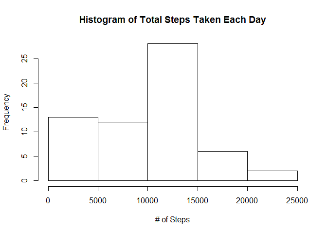
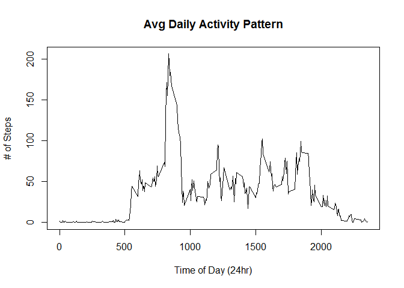
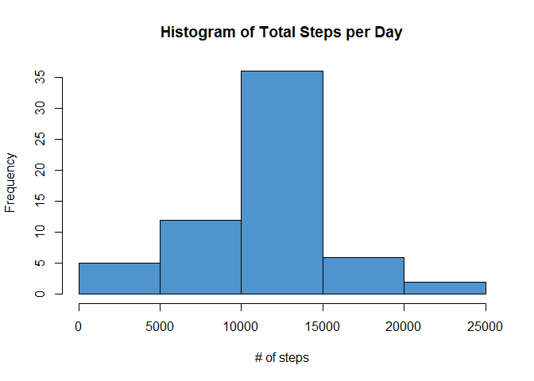
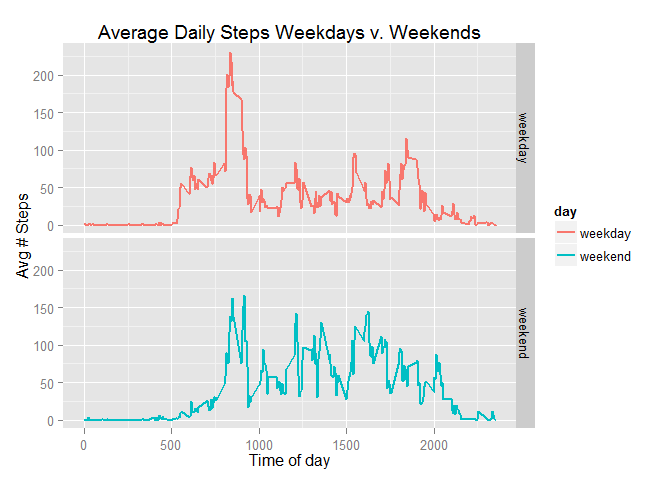

###Loading and preprocessing the data

Show any code that is needed to

1. Load the data (i.e. read.csv())


```r
activity <- read.csv("activity.csv")
```

2. Process/transform the data (if necessary) into a format suitable for your analysis

###What is mean total number of steps taken per day?

For this part of the assignment, you can ignore the missing values in the dataset.

1. Make a histogram of the total number of steps taken each day


```r
dailysteps <- tapply(activity$steps, activity$date,sum,na.rm=TRUE)
dailysteps <- as.data.frame(dailysteps)
dailysteps$date <- unique(activity$date)
row.names(dailysteps) <- NULL
hist(dailysteps$dailysteps,main = "Histogram of Total Steps Taken Each Day",xlab="# of Steps")
```

 

2. Calculate and report the mean and median total number of steps taken per day


```r
summary(dailysteps$dailysteps)
```

```
##    Min. 1st Qu.  Median    Mean 3rd Qu.    Max. 
##       0    6778   10400    9354   12810   21190
```

###What is the average daily activity pattern?

1. Make a time series plot (i.e. type = "l") of the 5-minute interval (x-axis) and the average number of steps taken, averaged across all days (y-axis)


```r
dp <- tapply(activity$steps, activity$interval,mean,na.rm=TRUE)
dp <- as.data.frame(dp)
dp$interval <- unique(activity$interval)
row.names(dp) <- NULL
names(dp)[1] <- "steps"
plot(dp$interval,dp$steps,type="l",main="Avg Daily Activity Pattern",xlab="Time of Day (24hr)",ylab="# of Steps")
```

 

2. Which 5-minute interval, on average across all the days in the dataset, contains the maximum number of steps?

```r
head(dp[order(-dp$steps),])
```

```
##        steps interval
## 104 206.1698      835
## 105 195.9245      840
## 107 183.3962      850
## 106 179.5660      845
## 103 177.3019      830
## 101 171.1509      820
```


###Imputing missing values

Note that there are a number of days/intervals where there are missing values (coded as NA). The presence of missing days may introduce bias into some calculations or summaries of the data.

1. Calculate and report the total number of missing values in the dataset (i.e. the total number of rows with NAs)


```r
act <- read.csv("activity.csv")
```


```r
## number of rows with missing values
nrow(act[is.na(act$steps)==TRUE,])
```

```
## [1] 2304
```

```r
## 2304
```

We have 2304 missing observations. Let's impute that data using the average for that 5-minute interval.

2. Devise a strategy for filling in all of the missing values in the dataset. The strategy does not need to be sophisticated. For example, you could use the mean/median for that day, or the mean for that 5-minute interval, etc.

First we calculcate averages for each interval:


```r
int_avg <- with(act,tapply(act$steps,act$interval,mean,na.rm=TRUE))
int_avg <- as.data.frame(int_avg)
row.names(int_avg) <- NULL
int_avg$interval <- unique(act$interval)
names(int_avg)[1] <- "avg_steps"
head(int_avg)
```

```
##   avg_steps interval
## 1 1.7169811        0
## 2 0.3396226        5
## 3 0.1320755       10
## 4 0.1509434       15
## 5 0.0754717       20
## 6 2.0943396       25
```

Then we must assign these averages to each missing observation associated with each interval.

let's create an imputation flag:

```r
act$imputation <- 0
act$imputation[is.na(act$steps)==TRUE] <- 1
act$imputation <- as.factor(act$imputation)
summary(act$imputation)
```

```
##     0     1 
## 15264  2304
```


3. Create a new dataset that is equal to the original dataset but with the missing data filled in.

Let's create an identical dataset but with filled in variables:

```r
act <- merge(act,int_avg,by.x="interval",by.y="interval")
act <- act[order(act$date),]
act$steps2 <- ifelse(is.na(act$steps)==TRUE,act$avg_steps,act$steps)

act2 <- act[,c("interval","steps2","date")]
names(act2)[2] <- "steps"
head(act2)
```

```
##     interval     steps       date
## 1          0 1.7169811 2012-10-01
## 63         5 0.3396226 2012-10-01
## 128       10 0.1320755 2012-10-01
## 205       15 0.1509434 2012-10-01
## 264       20 0.0754717 2012-10-01
## 327       25 2.0943396 2012-10-01
```


4. Make a histogram of the total number of steps taken each day and Calculate and report the mean and median total number of steps taken per day. Do these values differ from the estimates from the first part of the assignment? What is the impact of imputing missing data on the estimates of the total daily number of steps?

Let's look at a histogram of this new data:

```r
a2_sum <- with(act2,tapply(act2$steps,act2$date,sum,na.rm=TRUE))
a2_sum <- as.data.frame(a2_sum)
row.names(a2_sum) <- NULL
a2_sum$date <- unique(act2$date)
names(a2_sum)[1] <- "total_steps"
hist(a2_sum$total_steps,main="Histogram of Total Steps per Day",xlab="# of steps",col="steelblue3")
```

 

Let's take a look at the mean and median of our imputed dataset:

```r
summary(a2_sum$total_steps)
```

```
##    Min. 1st Qu.  Median    Mean 3rd Qu.    Max. 
##      41    9819   10770   10770   12810   21190
```

How does this compare to our previous dataset before the imputed values were included?

```r
a_sum <- with(act,tapply(act$steps,act$date,sum,na.rm=TRUE))
a_sum <- as.data.frame(a_sum)
row.names(a_sum) <- NULL
a_sum$date <- unique(act$date)
names(a_sum)[1] <- "total_steps"
summary(a_sum$total_steps)
```

```
##    Min. 1st Qu.  Median    Mean 3rd Qu.    Max. 
##       0    6778   10400    9354   12810   21190
```


### Are there differences in activity patterns between weekdays and weekends?

For this part the weekdays() function may be of some help here. Use the dataset with the filled-in missing values for this part.

1. Create a new factor variable in the dataset with two levels - "weekday" and "weekend" indicating whether a given date is a weekday or weekend day.


Let's create a day of the week variable:

```r
act2$date <- as.Date(act2$date)
act2$day <- as.factor(weekdays(act2$date))
act2$daytype <- "weekday"
act2$daytype[act2$day %in% c("Saturday","Sunday")] <- "weekend"
act2$daytype <- as.factor(act2$daytype)
summary(act2$daytype)
```

```
## weekday weekend 
##   12960    4608
```

Let's look at how the time of the day matters in weekend v. weekday for our new imputed dataset:

```r
int2_avg <- with(act2,tapply(steps,list(interval,daytype),mean,na.rm=TRUE))
int2_avg <- as.data.frame(int2_avg)
row.names(int2_avg) <- NULL
int2_avg$interval <- unique(act2$interval)

weekday <- int2_avg[,c("weekday","interval")]
weekday$day <- "weekday"
names(weekday)[1] <- "steps"
weekend <- int2_avg[,c("weekend","interval")]
weekend$day <- "weekend"
names(weekend)[1] <- "steps"

tmp <- rbind(weekday,weekend)
```


2. Make a panel plot containing a time series plot (i.e. type = "l") of the 5-minute interval (x-axis) and the average number of steps taken, averaged across all weekday days or weekend days (y-axis). See the README file in the GitHub repository to see an example of what this plot should look like using simulated data.


Let's make some plots:


```r
library(ggplot2)
```

```
## Warning: package 'ggplot2' was built under R version 3.1.1
```

```r
(ggplot(tmp,aes(x=interval,y=steps))
 + geom_line(aes(colour=day),size=1)
 + facet_grid(day ~ .)
 + labs(title = "Average Daily Steps Weekdays v. Weekends",x="Time of day",y="Avg # Steps")
 )
```

 

It looks like there are higher peaks during the weekdays (particularly in the morning), but there is more sustained activity on the weekend. Interesting.
